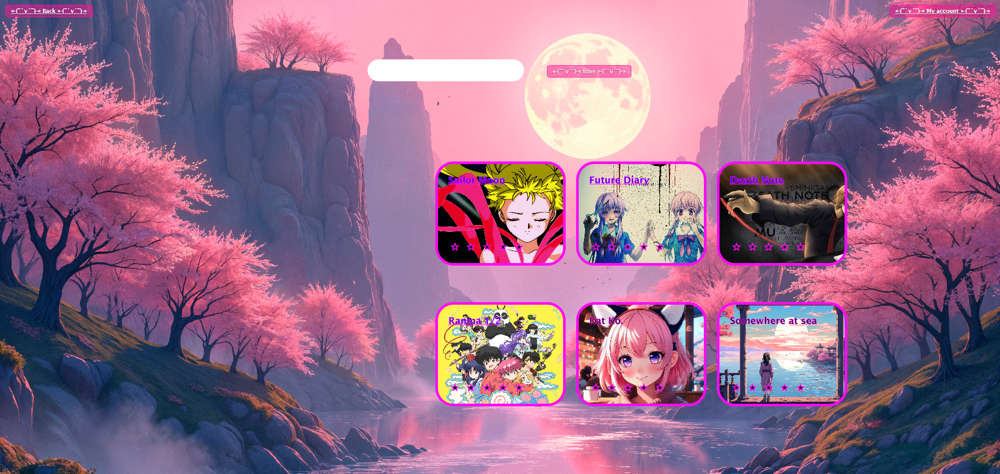

Rotten Potatoes
git pull
As an anime viewer, I want to find new animated shows/ movies to watch , so that I can be up to date on the latest media.

I also want to be able to rate the shows and movies for myself.

- What was your motivation? 

We love being able to see how the professionals rate shows/movies but we wanted to make one just for regular people to have as well. I want a site to access and rate animes I've watched and watch them again. 

We ran out of time, but future enhancements would be the ability for the user to add their own content to differenciate us from them

* improve user experience 
* Slideshow of anime shows when log in
* Search option
* Trending/popular this week
* Picture on Account Page (avtar/ profile picture)
* ability to add your own content, using the css already there
* Stars changed to Potatoes
* Logo

- What problem does it solve?

it allows the user to rate and watch their favorite anime shows.

- What did you learn?
we were able to use what we learned from the class and with the help of other resources, we learned how to get buttons to redirect correctly, drop down menu's, alert messages to work and a working modal

## Credits

https://github.com/lobungen
https://github.com/TiffanyMClark
https://github.com/elisha174

https://developer.mozilla.org/en-US/
https://www.geeksforgeeks.org/
https://www.w3schools.com/
https://www.geeksforgeeks.org/create-a-product-review-and-rating-system-using-html-css-and-javascript/
## License

MIT License

Copyright (c) [year] [fullname]

Permission is hereby granted, free of charge, to any person obtaining a copy
of this software and associated documentation files (the "Software"), to deal
in the Software without restriction, including without limitation the rights
to use, copy, modify, merge, publish, distribute, sublicense, and/or sell
copies of the Software, and to permit persons to whom the Software is
furnished to do so, subject to the following conditions:

The above copyright notice and this permission notice shall be included in all
copies or substantial portions of the Software.

THE SOFTWARE IS PROVIDED "AS IS", WITHOUT WARRANTY OF ANY KIND, EXPRESS OR
IMPLIED, INCLUDING BUT NOT LIMITED TO THE WARRANTIES OF MERCHANTABILITY,
FITNESS FOR A PARTICULAR PURPOSE AND NONINFRINGEMENT. IN NO EVENT SHALL THE
AUTHORS OR COPYRIGHT HOLDERS BE LIABLE FOR ANY CLAIM, DAMAGES OR OTHER
LIABILITY, WHETHER IN AN ACTION OF CONTRACT, TORT OR OTHERWISE, ARISING FROM,
OUT OF OR IN CONNECTION WITH THE SOFTWARE OR THE USE OR OTHER DEALINGS IN THE
SOFTWARE.

## Features

* It's done when the local storage saved username and password
* It's done when the log-in page can route to the main page after logging in
* It's done when you can create a profile
* It's done when you can reset your password
* It's done when the main page has a variety of anime shows/movies
* It's done when you can user preferences (audio) on the account page.
